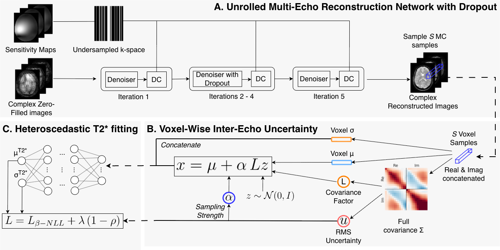

# CUPA-T2*: Covariance-Aware Uncertainty Propagation and Alignment for T2* Mapping in Accelerated MRI

**Gideon N. L. Rouwendaal**, Natascha Niessen, Hannah Eichhorn, Dirk H. J. Poot, Christine Preibisch, Julia A. Schnabel

Accepted at [Reconstruction and Imaging Motion Estimation (RIME) Workshop at MICCAI](https://rime-miccai.github.io/) | [Link to paper](https://arxiv.org/abs/2608.08693v1)

**Abstract:** 
Quantitative T2* maps have strong potential for biomarker discovery but are limited by long scan times, rendering them impractical in clinical settings. Significant acceleration can be achieved through undersampling in k-space combined with learning-based reconstruction. However, reconstruction artifacts and noise can propagate into downstream T2* fitting, degrading its accuracy. We introduce CUPA-T2*, a framework that explicitly propagates voxel-wise inter-echo uncertainty from stochastic Monte Carlo dropout reconstructions to downstream T2* fitting via covariance-aware sampling. T2* fitting is performed with a heteroscedastic MLP and a correlation-based regularizer that encourages alignment between predicted variance and reconstruction uncertainty. Experiments on accelerated brain MRI data show tissue-dependent behavior: CUPA-T2* achieves competitive overall T2* fitting performance and improves white-matter performance at higher accelerations. Compared with a heteroscedastic baseline, the proposed framework substantially increases alignment between reconstruction uncertainty and predicted T2* variance, while also revealing a trade-off with calibration (ECE) and selective prediction performance (AURC). CUPA-T2* enables reconstruction uncertainty-aware T2* fitting and delivers voxel-wise uncertainty maps to support the interpretation of quantitative T2* estimates.

**Keywords:** Quantitative MRI · T2* mapping · Uncertainty Propagation · Uncertainty Quantification


## Citation
If you use this code, please cite our paper:

```
@misc{rouwendaal2026cupat2,
      title={CUPA-T2*: Covariance-Aware Uncertainty Propagation and Alignment for T2* Mapping in Accelerated MRI}, 
      author={Gideon N. L. Rouwendaal and Natascha Niessen and Hannah Eichhorn and Dirk H. J. Poot and Christine Preibisch and Julia A. Schnabel},
      year={2026},
      eprint={2608.08693},
      archivePrefix={arXiv},
      primaryClass={cs.CV},
      url={https://arxiv.org/abs/2608.08693}, 
}
```

## Data availability
The publicly available [T2*-MOVE dataset](https://doi.org/10.15134/2kek-3553) for quantitative T2* mapping of the human brain is used.

To load the dataset correctly, please follow the supplementary [code](https://github.com/compai-lab/2025-nefeli-eichhorn) of the dataset.

## Contents of this repository:

- `iml-dl`: code belonging to the above work, using an adapted version of the [IML-CompAI Framework](https://github.com/compai-lab/iml-dl), the [MERLIN Framework](https://github.com/midas-tum/merlin), and the [PHIMO+ framework](https://github.com/compai-lab/2025-mrm-eichhorn). 

All computations were performed using Python 3.8.12 and PyTorch 2.0.1. 


## Setup:

1. Create a virtual environment with the required packages:
    ```
    cd ${TARGET_DIR}/CUPA-T2*
    conda env create -f conda_env.yml
    source activate cupa_T2_star *or* conda activate cupa_T2_star
    ```

2. Install pytorch with cuda:
    ```
    conda install pytorch torchvision torchaudio pytorch-cuda=11.7 -c pytorch -c nvidia
    pip install torchinfo
    conda install -c conda-forge pytorch-lightning
    ```

3. For setting up wandb please refer to the [IML-CompAI Framework](https://github.com/compai-lab/iml-dl).


## Steps to reproduce the analysis:

1. Setup the dataset, according to the supplementary [code](https://github.com/compai-lab/2025-nefeli-eichhorn) of the dataset.
   
2. Train the reconstruction networks, following the [PHIMO+ framework](https://github.com/compai-lab/2025-mrm-eichhorn), but using the provided configs, under CUPA-T2*/iml-dl/projects/recon_t2star/configs/mrm

3. Follow the steps in the [README in the regress folder](iml-dl/projects/regress_t2star/README.md)

## Illustration of CUPA-T2*:
<p align="center">

</p>

<p style="text-align: justify;">
Overview of the CUPA-T2* framework. (A) An unrolled multi-echo reconstruction network with MC dropout. (B) Voxel-wise inter-echo covariance is estimated from MC samples and factorized to enable covariance-aware sampling, modulated by RMS uncertainty. (C) A heteroscedastic T2* regressor predicts mean and variance, trained with ß-NLL and RMS-based cross-stage uncertainty losses.
</p>
